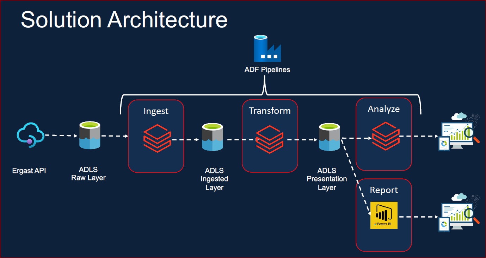
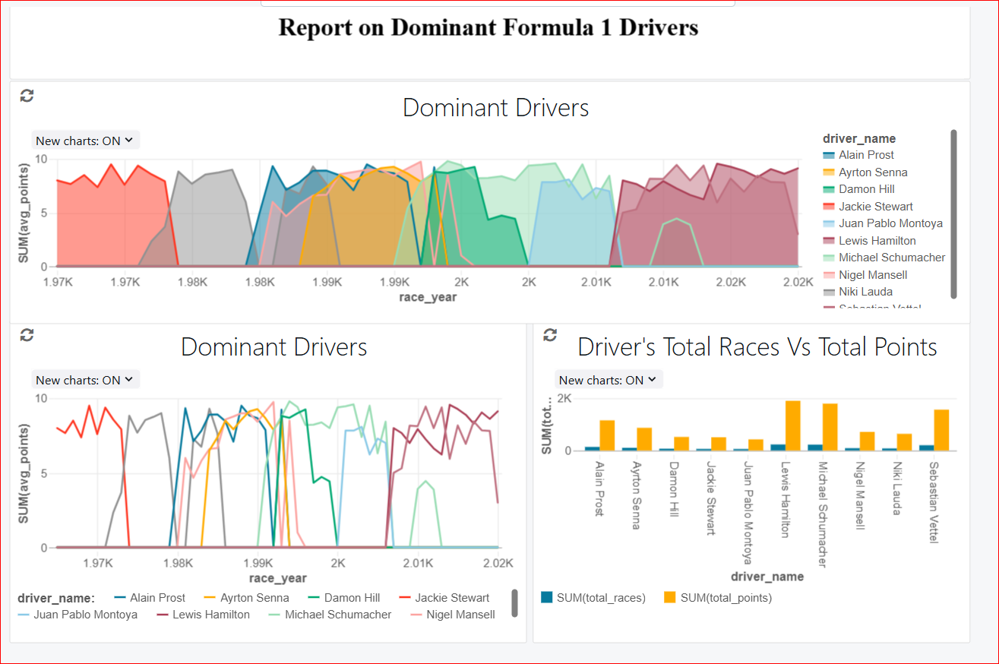
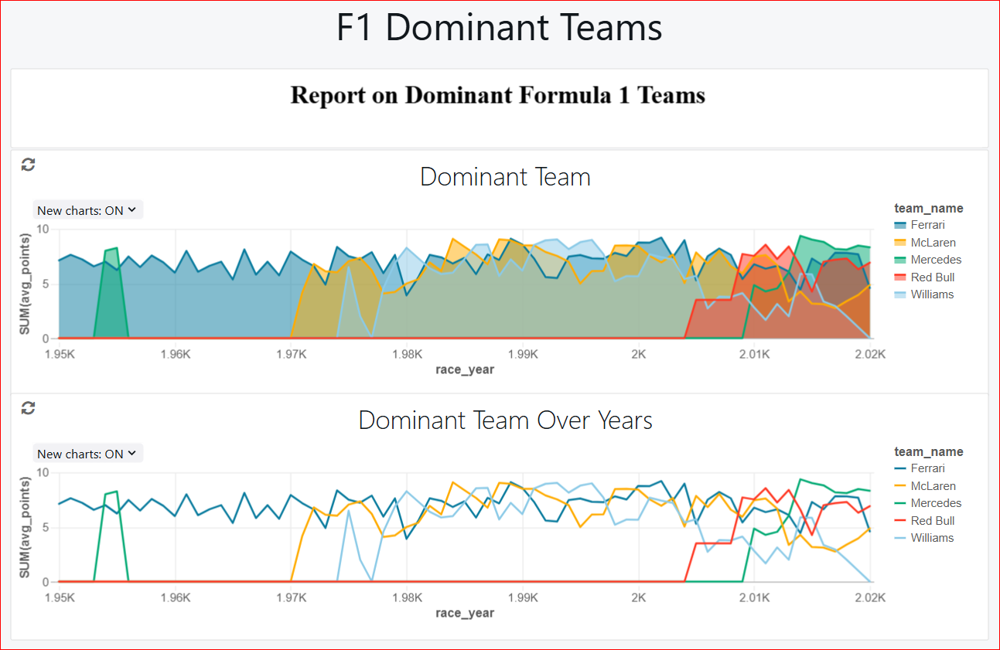

# Azure-End-To-End-DE-Project-For-Formula1-Racing-Analysis
A complete azure end-to-end project for analyzing formula1 racing from 1950-2021

## Project Overview:
This project aims to develop a comprehensive data engineering pipeline for analyzing Formula 1 race results using Azure Databricks and Azure Data Factory. The pipeline is designed to perform ETL (Extract, Transform, Load) operations, sourcing data from ergast.com, a platform dedicated to Formula 1 statistics. It enables incremental data loads and stores the processed data in Azure Data Lake Gen2 storage. Azure Databricks handles data transformation and advanced analytics, while Azure Data Factory orchestrates the entire workflow. Finally, the fully processed data is utilized to create an insightful Power BI dashboard for visual analysis.

## Formula 1 Racing Overview:
**Formula 1 (F1)** is the pinnacle of single-seater auto racing globally, governed by the **Fédération Internationale de l'Automobile (FIA)**. It features cutting-edge cars equipped with hybrid power units that combine turbocharged internal combustion engines with advanced energy recovery systems.

The F1 season takes place annually and consists of a series of races, referred to as Grands Prix (GPs), held over weekends across various circuits worldwide. Each event spans three days, typically beginning on Friday with practice sessions, followed by a qualifying session on Saturday to determine the grid positions for the main race on Sunday.

In a typical season, there are 20 to 24 Grands Prix, though this number can vary slightly. Races are held on a mix of permanent racetracks and temporary street circuits, such as the iconic Monaco Grand Prix. Safety remains a critical focus, with stringent FIA regulations and technological innovations continually enhancing the protection of drivers, teams, and spectators.

There are currently 10 teams in F1, each fielding two drivers, making up a grid of 20 competitors. Teams operate meticulously, with key strategies including pit stops for tire changes and minor car adjustments during races. The race distances usually cover a total of around 305 km (190 miles), which translates to a variable number of laps depending on the length of the circuit.

The results of each race contribute to the **Drivers' Championship standings** and the **Constructors' Championship standings**. At the end of the season:
1. The driver with the most points is crowned the **World Drivers' Champion**.
2. The team with the highest points tally wins the **World Constructors' Championship**.

## Solution Architecture for the Problem Statement

The data model is inspired by [Azure Databricks Modern Analytics Architecture](https://learn.microsoft.com/en-us/azure/architecture/solution-ideas/articles/azure-databricks-modern-analytics-architecture)

## ER Diagram
The database structure is illustrated in the accompanying ER Diagram and detailed further in the [Data User Guide](https://github.com/VBS-03/Formula1-Racing-Analysis-Azure-End-To-End-Project/blob/main/formula1_ergast_data_user_guide.txt)

## Implementation Plan
---
### Source Data
We are utilizing open-source data from the Ergast Developer API, which provides comprehensive Formula 1 data ranging from the year 1950 to 2021. The various data files along with the file type are mentioned below:
| File Name | File Type|
|-----------|----------|
| Circuits | CSV |
| Races	| CSV |
| Constructors | Single Line JSON |
| Drivers	| Single Line Nested JSON |
| Results	| Single Line JSON |
| PitStops | Multi Line JSON |
| LapTimes | Split CSV Files |
| Qualifying | Split Multi Line JSON Files |

### Project Requirements:
The requirements for this project are broken down into six different parts which are

**1. Data Ingestion Requirements**
- Ingest all 8 files into Azure data lake.
- Ingested data must have the same schema applied.
- Ingested data must have audit columns.
- Ingested data must be stored in columnar format (i.e., parquet).
- We must be able to analyze the ingested data via SQL.
- Ingestion Logic must be able to handle the incremental load.
  
**2. Data Transformation Requirements**
- Join the key information required for reporting to create a new table.
- Join the key information required for analysis to create a new table.
- Transformed tables must have audit columns.
- We must be able to analyze the transformed data via SQL.
- Transformed data must be stored in columnar format (i.e., parquet).
- Transformation logic must be able to handle the incremental load.
  
**3. Data Reporting Requirements**
- Determine Driver Standings.
- Determine Constructor Standings.
  
**4. Data Analysis Requirements**
- Find the Dominant Drivers.
- Find the Dominant Teams.
- Visualize the outputs by creating Databricks Dashboards.
- Develop a Power BI dashboard to visualize data and extract actionable insights.
  
**5. Scheduling Requirements**
- Scheduled to run every Sunday at 10 pm.
- Ability to monitor pipelines.
- Ability to re-run failed pipelines.
- Ability to set up alerts on failures.
  
**6. Other Non-Functional Requirements**
- Ability to delete individual records.
- Ability to see history and time travel.
- Ability to roll back to a previous version.
  
### Azure Services Utilized for this Project's Implementation:
- Azure Data Lake Storage Gen2
- Azure Data Factory
- Azure Databricks
- Azure Key Vault

## Implementation
---
### Overview:
- Azure Data Factory (ADF) plays a pivotal role in orchestrating and monitoring the execution of Azure Databricks notebooks. The workflow begins with importing data from the Ergast API and storing it in Azure Data Lake Storage Gen2 (ADLS). Initially, raw data is loaded into the Bronze container, which acts as the landing zone.

- To process the data in the Bronze zone, an Azure Databricks notebook performs data transformation using the upsert operation, converting the data into delta tables. Once this process is complete, ADF moves the transformed data to the Silver zone in ADLS. The Silver zone serves as the standardization layer, preparing the data for advanced use cases such as data science and machine learning.

- In the Silver zone, further data refinement occurs through an Azure Databricks SQL notebook, where operations like joins and aggregations are applied to structure the data for analytics and visualization. The final transformed results are loaded into the Gold zone, which functions as the analytical layer, supporting in-depth analysis and reporting.

- The entire implementation, from data ingestion and transformation to joining, aggregation, and preparing the ETL process to support incremental loads, has been orchestrated using Azure Data Factory (ADF). By creating a scheduled pipeline, ADF effectively manages and automates the entire workflow.

### Security, Governance and Mounts to ADLS:
- Created Azure Key Vault 
- Created Service Principal and generated the secret
- Added the secrets to Azure Key Vault
- Created the Databricks Secret Scope and linked Azure Key Vault to it.
- Get secrets in the notebook using **dbutils.secrets.get**
- Created mounts to the containers in ADLS **( Raw = Bronze, Processed = Silver, Presentation = Gold )**

  **Script - [mount_adls_storage](set-up/mount_adls_storage.py)**

### Ingestion, Transformation and Aggregation:
- Utilized databricks notebook for the ingestion, transformation and aggregation.
- Created and passed notebook parameters.
- Compiled and converted re-usable codes to functions.
- Used magic command **%run** to include the child notebook in the parent notebook.
- Created notebook workflow for the testing purpose.

  **Following are the steps taken to meet the ingestion, transformation and aggregation requirements:**
  * Created Delta Lake databases (each for - raw, processed and presentation layers) with default storage location in the adls.
  * Ingested CSV, simple, and complex JSON files into the data lake as parquet files/ tables.
  * Transformations such as Filter, Join, Simple Aggregations, GroupBy, Window functions, withColumn, withColumnRenamed, etc have been used.
  * **'dropDuplicates'** function has been utilized to remove duplicate records from the dataset. 
  * Global and temp views were also used.
  * **Merge** command has been used to upsert the data into the delta tables supporting the efficient incremental loading.
  * Implemented full refresh and incremental load patterns using partitions. 
  * Delta Lake has been used to support the History, Time Travel, and Vacuum functionalities offered by it.
  * All the implementation were made using pyspark and spark sql.
 
  **Scripts :**
  1. [common_functions](includes/common_functions.py)
  2. [configuration](includes/configuration.py)
  3. [create_raw_tables](raw/1.create_raw_tables.sql)
  4. [prepare_for_incremental_load](utils/1.prepare_for_incremental_load.sql)
  5. [ingestion](ingestion)
  6. [trans](trans)

### Reporting requirement:
- Further we have created the calculated_race_results based on the **race_results** which we have generated in the presentation layer.
- Used Window Function **"Rank"** to determine the drivers standing and constructors standing using the **race_results** output.
- Created delta tables for each of them so that it could be utlized for further analysis and report generation in Databricks and Power BI. 

  ** Scripts :**
  1. [Driver Standings](trans/2.driver_standings.py)
  2. [Constructor Standings](trans/3.constructor_standings.py)
  3. [Calculated Race Results](trans/4.calculated_race_results.py)
 
### Analysis and reporting in databricks:
- Written the sql scripts to find the dominant drivers and dominant constructors.
- Used these scripts for the generation of visuals to perform analysis.

  **Scripts :**
  * [Analysis](analysis)

  ** Following are the visual reports created for the analysis:

