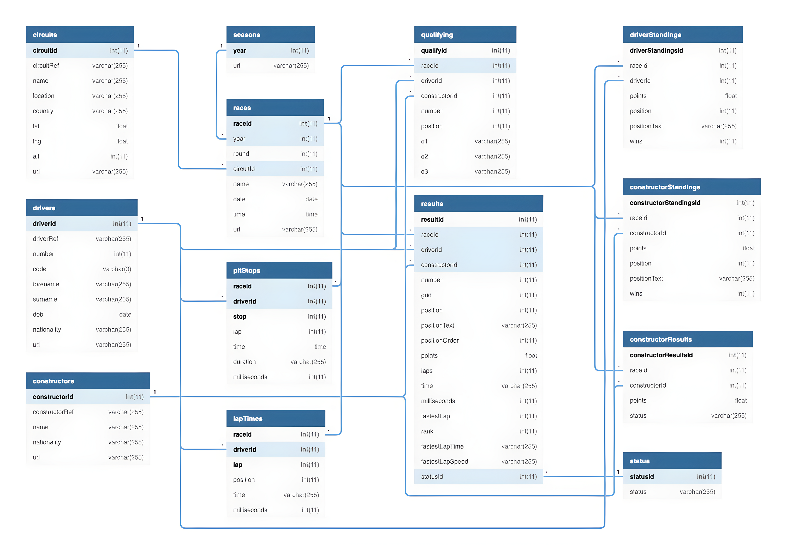

# Azure-End-To-End-Project-For-Formula1-Racing-Analysis
A complete azure end-to-end project for analyzing formula1 racing from 1950-2021

## Project Overview:
This project aims to develop a comprehensive data engineering pipeline for analyzing Formula 1 race results using Azure Databricks and Azure Data Factory. The pipeline is designed to perform ETL (Extract, Transform, Load) operations, sourcing data from ergast.com, a platform dedicated to Formula 1 statistics. It enables incremental data loads and stores the processed data in Azure Data Lake Gen2 storage. Azure Databricks handles data transformation and advanced analytics, while Azure Data Factory orchestrates the entire workflow. Finally, the fully processed data is utilized to create an insightful Power BI dashboard for visual analysis.

## Formula 1 Racing Overview:
**Formula 1 (F1)** is the pinnacle of single-seater auto racing globally, governed by the **Fédération Internationale de l'Automobile (FIA)**. It features cutting-edge cars equipped with hybrid power units that combine turbocharged internal combustion engines with advanced energy recovery systems.

The F1 season takes place annually and consists of a series of races, referred to as Grands Prix (GPs), held over weekends across various circuits worldwide. Each event spans three days, typically beginning on Friday with practice sessions, followed by a qualifying session on Saturday to determine the grid positions for the main race on Sunday.

In a typical season, there are 20 to 24 Grands Prix, though this number can vary slightly. Races are held on a mix of permanent racetracks and temporary street circuits, such as the iconic Monaco Grand Prix. Safety remains a critical focus, with stringent FIA regulations and technological innovations continually enhancing the protection of drivers, teams, and spectators.

There are currently 10 teams in F1, each fielding two drivers, making up a grid of 20 competitors. Teams operate meticulously, with key strategies including pit stops for tire changes and minor car adjustments during races. The race distances usually cover a total of around 305 km (190 miles), which translates to a variable number of laps depending on the length of the circuit.

The results of each race contribute to the **Drivers' Championship standings** and the **Constructors' Championship standings**. At the end of the season:
1. The driver with the most points is crowned the **World Drivers' Champion**.
2. The team with the highest points tally wins the **World Constructors' Championship**.

## ER Diagram
The database structure is illustrated in the accompanying ER Diagram and detailed further in the [Database User Guide.]([https://www.example.com](https://github.com/VBS-03/Formula1-Racing-Analysis-Azure-End-To-End-Project/blob/main/formula1_ergast_data_user_guide.txt))

