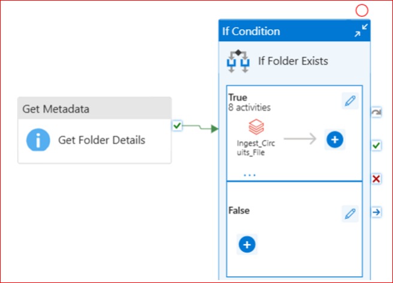
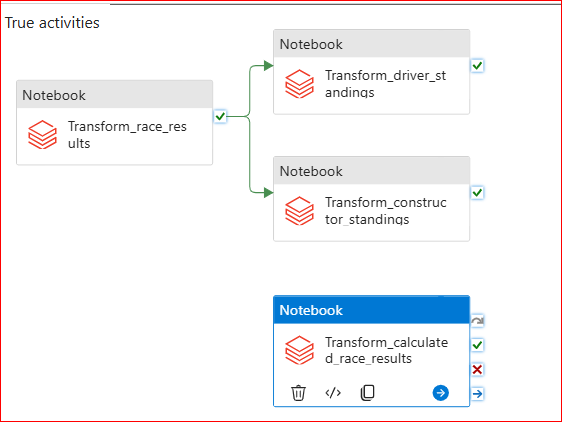
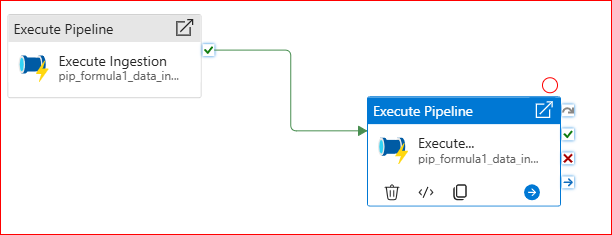
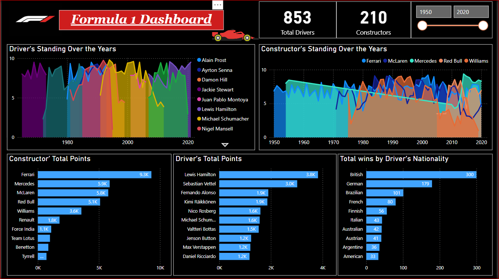

# Azure-End-To-End-DE-Project-For-Formula1-Racing-Analysis
A complete azure end-to-end project for analyzing formula1 racing from 1950-2021

## Project Overview:
This project aims to develop a comprehensive data engineering pipeline for analyzing Formula 1 race results using Azure Databricks and Azure Data Factory. The pipeline is designed to perform ETL (Extract, Transform, Load) operations, sourcing data from ergast.com, a platform dedicated to Formula 1 statistics. It enables incremental data loads and stores the processed data in Azure Data Lake Gen2 storage. Azure Databricks handles data transformation and advanced analytics, while Azure Data Factory orchestrates the entire workflow. Finally, the fully processed data is utilized to create an insightful Power BI dashboard for visual analysis.

## Formula 1 Racing Overview:
**Formula 1 (F1)** is the pinnacle of single-seater auto racing globally, governed by the **Fédération Internationale de l'Automobile (FIA)**. It features cutting-edge cars equipped with hybrid power units that combine turbocharged internal combustion engines with advanced energy recovery systems.

The F1 season takes place annually and consists of a series of races, referred to as Grands Prix (GPs), held over weekends across various circuits worldwide. Each event spans three days, typically beginning on Friday with practice sessions, followed by a qualifying session on Saturday to determine the grid positions for the main race on Sunday.

In a typical season, there are 20 to 24 Grands Prix, though this number can vary slightly. Races are held on a mix of permanent racetracks and temporary street circuits, such as the iconic Monaco Grand Prix. Safety remains a critical focus, with stringent FIA regulations and technological innovations continually enhancing the protection of drivers, teams, and spectators.

There are currently 10 teams in F1, each fielding two drivers, making up a grid of 20 competitors. Teams operate meticulously, with key strategies including pit stops for tire changes and minor car adjustments during races. The race distances usually cover a total of around 305 km (190 miles), which translates to a variable number of laps depending on the length of the circuit.

The results of each race contribute to the **Drivers' Championship standings** and the **Constructors' Championship standings**. At the end of the season:
1. The driver with the most points is crowned the **World Drivers' Champion**.
2. The team with the highest points tally wins the **World Constructors' Championship**.

## Solution Architecture for the Problem Statement

The data model is inspired by [Azure Databricks Modern Analytics Architecture](https://learn.microsoft.com/en-us/azure/architecture/solution-ideas/articles/azure-databricks-modern-analytics-architecture)

## ER Diagram
The database structure is illustrated in the accompanying ER Diagram and detailed further in the [Data User Guide](https://github.com/VBS-03/Formula1-Racing-Analysis-Azure-End-To-End-Project/blob/main/formula1_ergast_data_user_guide.txt)

## Implementation Plan
---
### Source Data
We are utilizing open-source data from the Ergast Developer API, which provides comprehensive Formula 1 data ranging from the year 1950 to 2021. The various data files along with the file type are mentioned below:
| File Name | File Type|
|-----------|----------|
| Circuits | CSV |
| Races	| CSV |
| Constructors | Single Line JSON |
| Drivers	| Single Line Nested JSON |
| Results	| Single Line JSON |
| PitStops | Multi Line JSON |
| LapTimes | Split CSV Files |
| Qualifying | Split Multi Line JSON Files |

### Project Requirements:
The requirements for this project are broken down into six different parts which are

**1. Data Ingestion Requirements**
- Ingest all 8 files into Azure data lake.
- Ingested data must have the same schema applied.
- Ingested data must have audit columns.
- Ingested data must be stored in columnar format (i.e., parquet).
- We must be able to analyze the ingested data via SQL.
- Ingestion Logic must be able to handle the incremental load.
  
**2. Data Transformation Requirements**
- Join the key information required for reporting to create a new table.
- Join the key information required for analysis to create a new table.
- Transformed tables must have audit columns.
- We must be able to analyze the transformed data via SQL.
- Transformed data must be stored in columnar format (i.e., parquet).
- Transformation logic must be able to handle the incremental load.
  
**3. Data Reporting Requirements**
- Determine Driver Standings.
- Determine Constructor Standings.
  
**4. Data Analysis Requirements**
- Find the Dominant Drivers.
- Find the Dominant Teams.
- Visualize the outputs by creating Databricks Dashboards.
- Develop a Power BI dashboard to visualize data and extract actionable insights.
  
**5. Scheduling Requirements**
- Scheduled to run every Sunday at 10 pm.
- Ability to monitor pipelines.
- Ability to re-run failed pipelines.
- Ability to set up alerts on failures.
  
**6. Other Non-Functional Requirements**
- Ability to delete individual records.
- Ability to see history and time travel.
- Ability to roll back to a previous version.
  
### Azure Services Utilized for this Project's Implementation:
- Azure Data Lake Storage Gen2
- Azure Data Factory
- Azure Databricks
- Azure Key Vault

## Implementation
---
### Overview:
- Azure Data Factory (ADF) plays a pivotal role in orchestrating and monitoring the execution of Azure Databricks notebooks. The workflow begins with importing data from the Ergast API and storing it in Azure Data Lake Storage Gen2 (ADLS). Initially, raw data is loaded into the Bronze container, which acts as the landing zone.

- To process the data in the Bronze zone, an Azure Databricks notebook performs data transformation using the upsert operation, converting the data into delta tables. Once this process is complete, ADF moves the transformed data to the Silver zone in ADLS. The Silver zone serves as the standardization layer, preparing the data for advanced use cases such as data science and machine learning.

- In the Silver zone, further data refinement occurs through an Azure Databricks SQL notebook, where operations like joins and aggregations are applied to structure the data for analytics and visualization. The final transformed results are loaded into the Gold zone, which functions as the analytical layer, supporting in-depth analysis and reporting.

- The entire implementation, from data ingestion and transformation to joining, aggregation, and preparing the ETL process to support incremental loads, has been orchestrated using Azure Data Factory (ADF). By creating a scheduled pipeline, ADF effectively manages and automates the entire workflow.

### Security, Governance and Mounts to ADLS:
- Created Azure Key Vault 
- Created Service Principal and generated the secret
- Added the secrets to Azure Key Vault
- Created the Databricks Secret Scope and linked Azure Key Vault to it.
- Get secrets in the notebook using **dbutils.secrets.get**
- Created mounts to the containers in ADLS **( Raw = Bronze, Processed = Silver, Presentation = Gold )**

  **Script - [mount_adls_storage](set-up/mount_adls_storage.py)**

### Ingestion, Transformation and Aggregation:
- Leveraged Databricks notebooks for data ingestion, transformation, and aggregation.
- Configured and utilized notebook parameters to dynamically control workflows.
- Refactored reusable code into functions for better modularity and efficiency.
- Integrated child notebooks into parent notebooks using the **%run** magic command.
- Developed a notebook-based workflow to facilitate testing purposes.

  **Steps undertaken to meet ingestion, transformation, and aggregation requirements:**
  * Designed Delta Lake databases for raw, processed, and presentation layers, with default storage locations in Azure Data Lake Storage (ADLS).
  * Ingested CSV, simple, and complex JSON files into the data lake as parquet files/ tables.
  * Applied transformations such as **Filter, Join, Aggregations, GroupBy, Window functions, withColumn, and withColumnRenamed**.
  * Utilized the **dropDuplicates** function to eliminate duplicate records.
  * Leveraged **global and temporary views** for intermediate transformations.
  * Implemented **Merge** commands to efficiently upsert data into Delta tables, enabling incremental data loading.
  * Developed patterns for both full refresh and incremental load using partitions.
  * Exploited Delta Lake features like **History, Time Travel, and Vacuum** to meet non-functional requirements.
  * All implementations were carried out using PySpark and Spark SQL.
 
  **Scripts :**
  1. [common_functions](includes/common_functions.py)
  2. [configuration](includes/configuration.py)
  3. [create_raw_tables](raw/1.create_raw_tables.sql)
  4. [prepare_for_incremental_load](utils/1.prepare_for_incremental_load.sql)
  5. [ingestion](ingestion)
  6. [trans](trans)

### Reporting requirement:
- Developed the calculated_race_results table based on the race_results data generated in the presentation layer.
- Utilized the **Rank window function** to compute driver standings and constructor standings using the race_results output.
- Created Delta tables for both standings, enabling further analysis and report generation in **Databricks and Power BI**. 

  ** Scripts :**
  1. [Driver Standings](trans/2.driver_standings.py)
  2. [Constructor Standings](trans/3.constructor_standings.py)
  3. [Calculated Race Results](trans/4.calculated_race_results.py)
 
### Analysis and reporting in databricks:
- Developed SQL scripts to identify dominant drivers and dominant constructors based on performance metrics.
- Leveraged these scripts to create visuals and perform detailed analysis.

  **Scripts :**
  * [Analysis](analysis)

  ** Following are the visual reports created for the analysis:

### ETL Pipeline:
Azure Data Factory (ADF) was used to design and implement a robust data orchestration pipeline that supports data ingestion, transformation, and loading. 
**The pipeline is divided into two key components:**
  * **Ingestion:** Transfers data from the Bronze zone (raw data) to the Silver zone (standardized data). [<ins>Note: Although direct ingestion from the Ergast API via an HTTP linked service was possible, raw files were loaded into the raw container to simplify project implementation.</ins>]
  * **Transformation:** Processes data from the Silver zone to the Gold zone, preparing it for analytical and reporting purposes.

**Key Activities in Each Pipeline:**
  * **Get Metadata Activity:** Retrieves folder details from the raw container to check if the folder for a specified date exists (based on the pipeline trigger parameter).
  * **If Condition Activity:**
      - Executes the TRUE path if the folder exists (using an exists flag set to True).
      - In case of ingestion pipeline, ingestion notebooks in the TRUE section execute concurrently, with no dependency order. While in the case of transformation pipeline, the included notebooks will execute as
        per the defined dependency.
      - If the folder is missing, the Get Metadata activity will pass exists flas as false and the FALSE path is executed. An email alert is triggered to notify that files for the specified date are missing but          the entire pipeline will be succeed.

**Ingestion Pipeline:**
  * **Data Sources:** Data in JSON and CSV formats is ingested using Apache Spark with minimal transformation.
  * **Transformations:**
      - Drop unnecessary columns.
      - Rename headers for consistency.
      - Apply predefined schema.
      - Add audit columns like ingestion_date and file_source for tracking purposes.
  * **Dynamic Parameters:** The file_date is passed dynamically as a notebook parameter in ADF to enable flexible processing workflows.
  * **Databricks Integration:**
      - The operations are carried out in Databricks ingestion notebooks.
      - A Linked Service to Databricks is configured to invoke notebooks from ADF triggers, with appropriate roles assigned for seamless integration.

          

**Transformation Pipeline:**
  * **Transformation Tasks:**
      - **Joins:** Consolidate data from multiple sources.
      - **Aggregations:** Use window functions to perform advanced analytics.
      - **Data Cleansing:** Remove duplicate records to ensure consistency.
  * Similar to the ingestion pipeline, this pipeline also contains Get Metadata and If Condition activities.
      - The True section contains notebooks that have dependencies, as shown in the diagram.
        
        
      - The execution flow follows the same logic as the ingestion pipeline, with email alerts triggered if any file is missing.
        
**Master Pipeline:**
  * **Master Pipeline:**
      - Combines both Ingestion and Transformation pipelines.
      - The Transformation pipeline runs only after the successful completion of the Ingestion pipeline.
  * **Trigger:**
      - A Tumbling Window Trigger is set to run every Sunday at 10 PM.
      - If data for a specific week is not available in the raw container, the pipeline skips that week’s execution. An email alert will be sent indicating the missing data.
        

### Power BI Dashboard Creation

**Dashboard** - [Formula1 Dashboard](Formula_1_Report.pbix)

